# Diagrama Entidade-Relacionamento - MVP SIGRA

Este documento apresenta o diagrama de entidade-relacionamento para o MVP (Produto Mínimo Viável) do SIGRA (Sistema Integrado de Gestão de Recorrentes e Associados).

## Diagrama ER Completo

```mermaid
erDiagram
    USERS ||--o{ CONSULTORES : possui
    USERS ||--o{ LIDERES_EQUIPE : possui
    USERS ||--o{ SUPERVISOR_VENDAS : possui
    USERS ||--o{ COORDENADOR_VENDAS : possui
    USERS ||--o{ GERENTE_COMERCIAL : possui
    USERS ||--o{ DIRETOR_COMERCIAL : possui
    USERS ||--o{ BANK_ACCOUNTS : possui
    USERS ||--o{ ADVANCE_PAYMENTS : solicita
    USERS ||--o{ REQUISICAO : cria
    USERS ||--o{ SGA_SYNC_LOGS : responsável

    REGIONAL ||--o{ COOPERATIVES : contém
    
    COOPERATIVES ||--o{ CONSULTORES : vinculado
    COOPERATIVES ||--o{ LIDERES_EQUIPE : vinculado
    COOPERATIVES ||--o{ SUPERVISOR_VENDAS : vinculado
    COOPERATIVES ||--o{ COORDENADOR_VENDAS : vinculado
    COOPERATIVES ||--o{ GERENTE_COMERCIAL : vinculado
    COOPERATIVES ||--o{ DIRETOR_COMERCIAL : vinculado
    COOPERATIVES ||--o{ ASSOCIADOS : pertence
    COOPERATIVES ||--o{ VEICULO : registrado
    COOPERATIVES ||--o{ BOLETO : emite
    COOPERATIVES ||--o{ RECURRENTS : registra
    
    ASSOCIADOS ||--o{ VEICULO : possui
    ASSOCIADOS ||--o{ BOLETO : paga
    ASSOCIADOS ||--o{ RECURRENTS : gera
    ASSOCIADOS ||--o{ ASSOCIATE_REFERRALS : "indicador (referrer)"
    ASSOCIADOS ||--o{ ASSOCIATE_REFERRALS : "indicado (referred)"
    ASSOCIADOS ||--o{ ASSOCIADOS : indica

    VEICULO ||--o{ BOLETO : gera
    
    CONSULTORES ||--o{ RECURRENTS : responsável
    
    SGA ||--o{ REQUISICAO : contém
    SGA ||--o{ SGA_SYNC_LOGS : registra
    
    REQUISICAO ||--o{ SGA_SYNC_LOGS : origina
    REQUISICAO ||--o{ REQUISICAO : depende
    
    ASSOCIATE_REFERRALS ||--o{ REFERRAL_DISCOUNT_HISTORY : gera

    USERS {
        CHAR(36) codigo_users_PK
        VARCHAR(255) users_nome
        VARCHAR(11) users_cpf
        VARCHAR(11) users_telefone
        VARCHAR(255) users_email
        VARCHAR(255) users_logradouro
        VARCHAR(10) users_numero
        VARCHAR(255) users_bairro
        VARCHAR(255) users_cidade
        VARCHAR(2) users_estado
        VARCHAR(8) users_cep
        VARCHAR(255) users_complemento
        VARCHAR(255) users_login
        VARCHAR(255) users_senha
        ENUM users_funcao
        BOOLEAN visualizar_campanhas
        BOOLEAN users_ativo
        TIMESTAMP last_login
        TIMESTAMP created_at
        TIMESTAMP updated_at
    }

    CONSULTORES {
        CHAR(36) codigo_consultor_PK
        CHAR(36) codigo_users_FK
        CHAR(36) codigo_cooperativa_FK
        VARCHAR(255) codigo_SGA_FK
        CHAR(36) codigo_voluntario_FK
        DECIMAL consultor_porcentagem_comissao_direta_visivel
        DECIMAL consultor_porcentagem_comissao_direta_invisivel
        DECIMAL consultor_porcentagem_retirada_direta
        BOOLEAN consultor_primeiro_lider_equipe_responsavel
        BOOLEAN consultor_segundo_lider_equipe_responsavel
        DECIMAL consultor_porcentagem_comissao_primeiro_lider_equipe
        DECIMAL consultor_porcentagem_comissao_segundo_lider_equipe
        TIMESTAMP created_at
        TIMESTAMP updated_at
    }

    LIDERES_EQUIPE {
        CHAR(36) codigo_lider_equipe_PK
        CHAR(36) codigo_users_FK
        CHAR(36) codigo_cooperativa_FK
        VARCHAR(255) codigo_SGA_FK
        CHAR(36) codigo_voluntario_FK
        DECIMAL lider_equipe_porcentagem_comissao_direta_visivel
        DECIMAL lider_equipe_porcentagem_comissao_direta_invisivel
        DECIMAL lider_equipe_porcentagem_retirada_direta
        BOOLEAN lider_equipe_primeiro_supervisor_vendas_responsavel
        BOOLEAN lider_equipe_segundo_supervisor_vendas_responsavel
        DECIMAL lider_equipe_porcentagem_comissao_primeiro_supervisor_vendas
        DECIMAL lider_equipe_porcentagem_comissao_segundo_supervisor_vendas
        TIMESTAMP created_at
        TIMESTAMP updated_at
    }

    SUPERVISOR_VENDAS {
        CHAR(36) codigo_supervisor_vendas_PK
        CHAR(36) codigo_users_FK
        CHAR(36) codigo_cooperativa_FK
        VARCHAR(255) codigo_SGA_FK
        CHAR(36) codigo_voluntario_FK
        DECIMAL supervisor_vendas_porcentagem_comissao_direta_visivel
        DECIMAL supervisor_vendas_porcentagem_comissao_direta_invisivel
        DECIMAL supervisor_vendas_porcentagem_retirada_direta
        BOOLEAN supervisor_vendas_primeiro_coordenador_vendas_responsavel
        BOOLEAN supervisor_vendas_segundo_coordenador_vendas_responsavel
        DECIMAL supervisor_vendas_porcentagem_comissao_primeiro_coordenador_vendas
        DECIMAL supervisor_vendas_porcentagem_comissao_segundo_coordenador_vendas
        TIMESTAMP created_at
        TIMESTAMP updated_at
    }

    COORDENADOR_VENDAS {
        CHAR(36) codigo_coordenador_vendas_PK
        CHAR(36) codigo_users_FK
        CHAR(36) codigo_cooperativa_FK
        VARCHAR(255) codigo_SGA_FK
        CHAR(36) codigo_voluntario_FK
        DECIMAL coordenador_vendas_porcentagem_comissao_direta_visivel
        DECIMAL coordenador_vendas_porcentagem_comissao_direta_invisivel
        DECIMAL coordenador_vendas_porcentagem_retirada_direta
        BOOLEAN coordenador_vendas_primeiro_gerente_comercial_responsavel
        BOOLEAN coordenador_vendas_segundo_gerente_comercial_responsavel
        DECIMAL coordenador_vendas_porcentagem_comissao_primeiro_gerente_comercial
        DECIMAL coordenador_vendas_porcentagem_comissao_segundo_gerente_comercial
        TIMESTAMP created_at
        TIMESTAMP updated_at
    }

    GERENTE_COMERCIAL {
        CHAR(36) codigo_gerente_comercial_PK
        CHAR(36) codigo_users_FK
        CHAR(36) codigo_cooperativa_FK
        VARCHAR(255) codigo_SGA_FK
        CHAR(36) codigo_voluntario_FK
        DECIMAL gerente_comercial_porcentagem_comissao_direta_visivel
        DECIMAL gerente_comercial_porcentagem_comissao_direta_invisivel
        DECIMAL gerente_comercial_porcentagem_retirada_direta
        BOOLEAN gerente_comercial_primeiro_diretor_comercial_responsavel
        BOOLEAN gerente_comercial_segundo_diretor_comercial_responsavel
        DECIMAL gerente_comercial_porcentagem_comissao_primeiro_diretor_comercial
        DECIMAL gerente_comercial_porcentagem_comissao_segundo_diretor_comercial
        TIMESTAMP created_at
        TIMESTAMP updated_at
    }

    DIRETOR_COMERCIAL {
        CHAR(36) codigo_diretor_comercial_PK
        CHAR(36) codigo_users_FK
        CHAR(36) codigo_cooperativa_FK
        VARCHAR(255) codigo_SGA_FK
        CHAR(36) codigo_voluntario_FK
        DECIMAL diretor_comercial_porcentagem_comissao_direta_visivel
        DECIMAL diretor_comercial_porcentagem_comissao_direta_invisivel
        DECIMAL diretor_comercial_porcentagem_retirada_direta
        TIMESTAMP created_at
        TIMESTAMP updated_at
    }

    REGIONAL {
        CHAR(36) codigo_regional_PK
        VARCHAR(255) nome_razao_social_regional
        VARCHAR(255) nome_fantasia_regional
        VARCHAR(14) cpf_cnpj_regional
        VARCHAR(255) logradouro_regional
        INT numero_regional
        VARCHAR(255) complemento_regional
        VARCHAR(255) bairro_regional
        VARCHAR(255) cidade_regional
        VARCHAR(255) estado_regional
        VARCHAR(8) cep_regional
        VARCHAR(15) telefone_regional
        VARCHAR(255) email_regional
        VARCHAR(255) representante_regional
        ENUM status_regional
        TIMESTAMP created_at
        TIMESTAMP updated_at
    }

    COOPERATIVES {
        CHAR(36) codigo_cooperativa_PK
        CHAR(36) codigo_regional_FK
        VARCHAR(255) nome_razao_social_cooperativa
        VARCHAR(255) nome_fantasia_cooperativa
        VARCHAR(255) logradouro_cooperativa
        INT numero_cooperativa
        VARCHAR(255) complemento_cooperativa
        VARCHAR(255) bairro_cooperativa
        VARCHAR(255) cidade_cooperativa
        VARCHAR(255) estado_cooperativa
        VARCHAR(8) cep_cooperativa
        VARCHAR(14) cpf_cnpj_cooperativa
        VARCHAR(15) telefone_cooperativa
        VARCHAR(255) email_cooperativa
        VARCHAR(255) representante_cooperativa
        ENUM status_cooperativa
        TIMESTAMP created_at
        TIMESTAMP updated_at
    }

    ASSOCIADOS {
        CHAR(36) codigo_associado_PK
        VARCHAR(255) associado_nome
        ENUM associado_sexo
        DATE associado_data_nascimento
        VARCHAR(255) associado_mae
        VARCHAR(255) associado_pai
        VARCHAR(255) associado_rg
        VARCHAR(255) associado_orgao_emissor
        DATE associado_data_emissao
        VARCHAR(255) associado_cnh
        VARCHAR(255) associado_categoria_cnh
        DATE associado_vencimento_cnh
        VARCHAR(14) associado_cpf
        VARCHAR(14) associado_telefone_fixo
        VARCHAR(15) associado_telefone_celular
        VARCHAR(15) associado_telefone_celular_auxiliar
        VARCHAR(255) associado_email
        VARCHAR(8) associado_cep
        VARCHAR(255) associado_logradouro
        VARCHAR(10) associado_numero
        VARCHAR(255) associado_complemento
        VARCHAR(255) associado_bairro
        VARCHAR(255) associado_cidade
        VARCHAR(255) associado_estado
        CHAR(36) codigo_regional_FK
        CHAR(36) codigo_cooperativa_FK
        VARCHAR(255) codigo_externo_FK
        CHAR(36) codigo_situacao_associado_FK
        CHAR(36) codigo_voluntario_FK
        VARCHAR(255) associado_descricao_situacao
        CHAR(36) associado_indicador_FK
        TIMESTAMP created_at
        TIMESTAMP updated_at
    }

    VEICULO {
        CHAR(36) codigo_veiculo_PK
        CHAR(36) codigo_associado_FK
        CHAR(36) codigo_cooperativa_FK
        CHAR(36) veiculo_codigo_voluntario
        VARCHAR(255) veiculo_codigo_fipe
        INT veiculo_ano_fabricacao
        INT veiculo_ano_modelo
        VARCHAR(7) veiculo_placa
        VARCHAR(17) veiculo_chassi
        VARCHAR(255) veiculo_renavam
        VARCHAR(255) veiculo_numero_motor
        INT veiculo_kilometragem
        VARCHAR(255) veiculo_codigo_alienacao
        VARCHAR(255) veiculo_codigo_combustivel
        VARCHAR(255) veiculo_codigo_cor
        VARCHAR(255) veiculo_codigo_tipo_veiculo
        VARCHAR(255) veiculo_codigo_tipo_adesao
        VARCHAR(255) veiculo_codigo_tipo_carga
        VARCHAR(255) veiuclo_codigo_tipo_carroceria
        VARCHAR(255) veiculo_codigo_categoria_veiculo
        DECIMAL veiculo_cota
        VARCHAR(255) veiculo_codigo_conta
        DECIMAL veiculo_valor_fixo
        INT veiculo_dia_vencimento
        ENUM veiculo_tipo
        ENUM veiculo_categoria
        VARCHAR(255) veiculo_marca
        VARCHAR(255) veiculo_modelo
        ENUM veiculo_descricao_situacao
        DECIMAL soma_fipe
        TIMESTAMP created_at
        TIMESTAMP updated_at
    }

    BOLETO {
        CHAR(36) codigo_boleto_PK
        VARCHAR(20) boleto_numero
        DECIMAL boleto_valor
        DATE boleto_data_vencimento
        DATE boleto_data_pagamento
        ENUM boleto_status
        CHAR(36) codigo_associado_FK
        CHAR(36) codigo_cooperativa_FK
        CHAR(36) boleto_codigo_voluntario
        CHAR(36) codigo_veiculo_FK
        INT boleto_mes_referencia
        TIMESTAMP created_at
        TIMESTAMP updated_at
    }

    BANK_ACCOUNTS {
        CHAR(36) codigo_dados_bancarios_PK
        CHAR(36) codigo_users_FK
        VARCHAR(255) nome_titular_dcb
        VARCHAR(14) cpf_cnpj_titular_dcb
        VARCHAR(255) nome_do_banco_dcb
        VARCHAR(20) numero_da_agencia_dcb
        VARCHAR(20) account_number
        ENUM tipo_conta_dcb
        ENUM tipo_chave_pix_dcb
        VARCHAR(255) chave_pix_dcb
        BOOLEAN verified
        TIMESTAMP created_at
        TIMESTAMP updated_at
    }

    ADVANCE_PAYMENTS {
        CHAR(36) codigo_adiantamento_PK
        CHAR(36) codigo_users_FK
        DECIMAL valor_solicitado_adiantamento
        DATE data_solicitacao_adiantamento
        ENUM status_adiantamento
        DECIMAL limite_adiantamento
        VARCHAR(255) comprovante_adiantamento
        DATE data_previsao_adiantamento
        TEXT nota_adiantamento
        TIMESTAMP created_at
        TIMESTAMP updated_at
    }

    SGA {
        CHAR(36) codigo_SGA_PK
        VARCHAR(255) sga_nome
        VARCHAR(255) sga_token_api
        VARCHAR(255) sga_url_base
        VARCHAR(255) sga_usuario_api
        VARCHAR(255) sga_senha_api
        TIME sga_horario_sincronizacao
        TIMESTAMP sga_ultima_sincronizacao
        ENUM sga_status
        CHAR(36) sga_usuario_responsavel
        VARCHAR(10) sga_versao_api
        INT sga_timeout_requisicao
        INT sga_max_tentativas_sincronizacao
        INT sga_intervalo_tentativas
        ENUM sga_modo_sincronizacao
        TIMESTAMP created_at
        TIMESTAMP updated_at
    }

    REQUISICAO {
        CHAR(36) codigo_requisicao_PK
        CHAR(36) codigo_SGA_FK
        VARCHAR(255) requisicao_nome
        TEXT requisicao_descricao
        VARCHAR(255) requisicao_url
        ENUM requisicao_metodo
        VARCHAR(255) requisicao_primeiro_nome_header
        VARCHAR(255) requisicao_primeiro_valor_header
        VARCHAR(255) requisicao_segundo_nome_header
        VARCHAR(255) requisicao_segundo_valor_header
        TEXT requisicao_body
        TEXT requisicao_parametros
        TEXT requisicao_mapeamento_resposta
        TIMESTAMP requisicao_ultima_execucao
        TEXT requisicao_resultado_ultima_execucao
        ENUM requisicao_status
        CHAR(36) requisicao_usuario_criacao
        TIMESTAMP requisicao_data_criacao
        TIMESTAMP requisicao_data_atualizacao
        ENUM requisicao_tipo
        INT requisicao_prioridade
        CHAR(36) requisicao_dependencia
        TIMESTAMP created_at
        TIMESTAMP updated_at
    }

    RECURRENTS {
        CHAR(36) codigo_recorrentes_PK
        CHAR(36) codigo_cooperativa_FK
        DECIMAL valor_recorrente
        CHAR(36) codigo_users_FK
        CHAR(36) codigo_associado_FK
        CHAR(36) codigo_consultor_FK
        DATE data_pagamento
        DATE data_vencimento
        ENUM status
        VARCHAR(7) mes_referencia
        VARCHAR(50) forma_pagamento
        TEXT observacoes
        BOOLEAN ativo
        TIMESTAMP created_at
        TIMESTAMP updated_at
    }

    ASSOCIATE_REFERRALS {
        CHAR(36) id
        CHAR(36) referrer_id
        CHAR(36) referred_id
        VARCHAR(10) vehicle_plate
        DECIMAL discount_percentage
        ENUM status
        TIMESTAMP registration_date
        TIMESTAMP last_status_change
        CHAR(36) created_by
        TEXT notes
        TIMESTAMP created_at
        TIMESTAMP updated_at
    }

    REFERRAL_DISCOUNT_HISTORY {
        CHAR(36) id
        CHAR(36) referral_id
        DATE month_reference
        DECIMAL discount_amount
        ENUM status
        VARCHAR(255) suspension_reason
        TIMESTAMP applied_date
        TIMESTAMP created_at
        TIMESTAMP updated_at
    }

    SGA_SYNC_LOGS {
        CHAR(36) id
        CHAR(36) codigo_SGA_FK
        TIMESTAMP data_inicio_sincronizacao
        TIMESTAMP data_fim_sincronizacao
        ENUM status
        INT quantidade_registros_processados
        INT quantidade_registros_atualizados
        INT quantidade_registros_novos
        INT quantidade_erros
        TEXT detalhes_erro
        CHAR(36) usuario_responsavel
        ENUM tipo_sincronizacao
        TEXT entidades_sincronizadas
        INT tempo_execucao_segundos
        CHAR(36) codigo_requisicao_FK
        INT tentativa_numero
        TIMESTAMP created_at
        TIMESTAMP updated_at
    }
```

## Descrição dos Relacionamentos

### Relacionamentos entre Usuários e Funções
- Um **USERS** pode ter um **CONSULTORES** (relação 1:0..1)
- Um **USERS** pode ter um **LIDERES_EQUIPE** (relação 1:0..1)
- Um **USERS** pode ter um **SUPERVISOR_VENDAS** (relação 1:0..1)
- Um **USERS** pode ter um **COORDENADOR_VENDAS** (relação 1:0..1)
- Um **USERS** pode ter um **GERENTE_COMERCIAL** (relação 1:0..1)
- Um **USERS** pode ter um **DIRETOR_COMERCIAL** (relação 1:0..1)

### Relacionamentos Financeiros
- Um **USERS** pode ter várias **BANK_ACCOUNTS** (relação 1:N)
- Um **USERS** pode solicitar vários **ADVANCE_PAYMENTS** (relação 1:N)

### Relacionamentos Hierárquicos
- Uma **REGIONAL** pode conter várias **COOPERATIVES** (relação 1:N)
- Uma **COOPERATIVES** pode ter vários **CONSULTORES**, **LIDERES_EQUIPE**, etc. (relação 1:N)

### Relacionamentos de Associados e Veículos
- Um **ASSOCIADOS** pertence a uma **COOPERATIVES** (relação N:1)
- Um **ASSOCIADOS** pode possuir vários **VEICULO** (relação 1:N)
- Um **ASSOCIADOS** pode indicar vários **ASSOCIADOS** (auto-relacionamento)
- Um **VEICULO** é registrado em uma **COOPERATIVES** (relação N:1)

### Relacionamentos Financeiros
- Um **ASSOCIADOS** pode gerar vários **BOLETO** (relação 1:N)
- Um **VEICULO** pode gerar vários **BOLETO** (relação 1:N)
- Um **ASSOCIADOS** pode ter vários **RECURRENTS** (relação 1:N)
- Um **CONSULTORES** pode ser responsável por vários **RECURRENTS** (relação 1:N)

### Relacionamentos de Integração
- Um **SGA** pode conter várias **REQUISICAO** (relação 1:N)
- Um **SGA** pode registrar vários **SGA_SYNC_LOGS** (relação 1:N)
- Uma **REQUISICAO** pode originar vários **SGA_SYNC_LOGS** (relação 1:N)
- Uma **REQUISICAO** pode depender de outra **REQUISICAO** (auto-relacionamento)

### Relacionamentos de Indicação
- Um **ASSOCIADOS** pode ser indicador em vários **ASSOCIATE_REFERRALS** (relação 1:N)
- Um **ASSOCIADOS** pode ser indicado em vários **ASSOCIATE_REFERRALS** (relação 1:N)
- Um **ASSOCIATE_REFERRALS** pode gerar vários **REFERRAL_DISCOUNT_HISTORY** (relação 1:N)

## Visão Resumida do Sistema

Este diagrama ER apresenta a estrutura completa do banco de dados para o MVP do SIGRA. O sistema é organizado em torno de entidades principais como Usuários, Associados, Veículos e suas interações. As entidades financeiras como Boletos e Recorrentes registram as transações financeiras, enquanto os módulos de integração com o SGA permitem a sincronização de dados entre sistemas.

A estrutura hierárquica de usuários (Consultores, Líderes de Equipe, etc.) permite o cálculo adequado de comissões e a gestão de equipes de vendas. O sistema de indicações entre associados é implementado usando as tabelas Associate_Referrals e Referral_Discount_History.

---

*Documento gerado para o MVP do SIGRA - Sistema Integrado de Gestão de Recorrentes e Associados* 