# Fluxograma do MVP - SIGRA (Sistema Integrado de Gestão de Recorrentes e Associados)

## 1. Visão Geral do Sistema

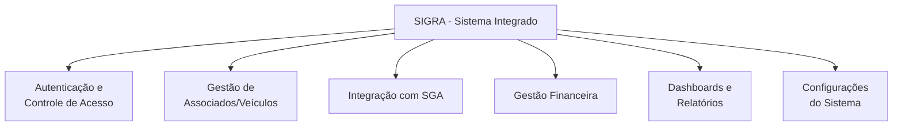

## 2. Módulo de Autenticação e Controle de Acesso

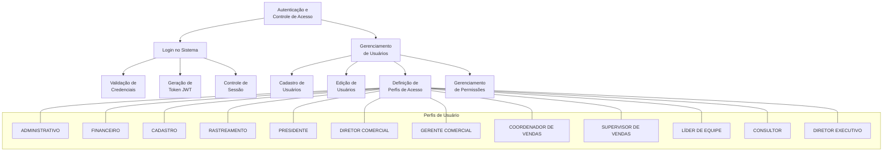

## 3. Módulo de Gestão de Associados/Veículos

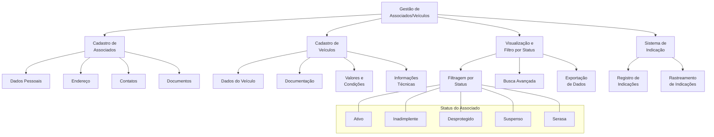

## 4. Módulo de Integração com SGA

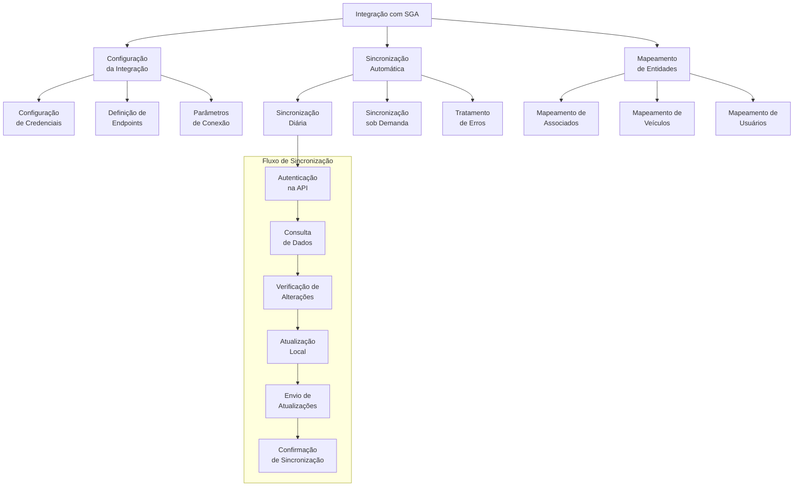

## 5. Módulo de Gestão Financeira

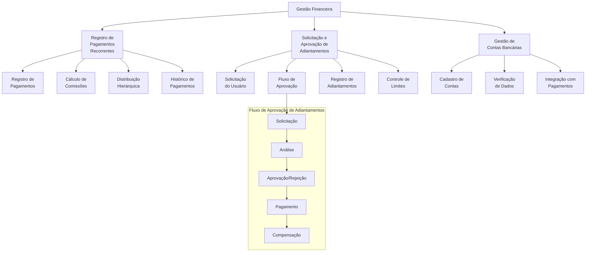

## 6. Módulo de Dashboards e Relatórios

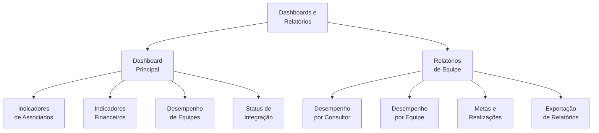

## 7. Módulo de Configurações do Sistema

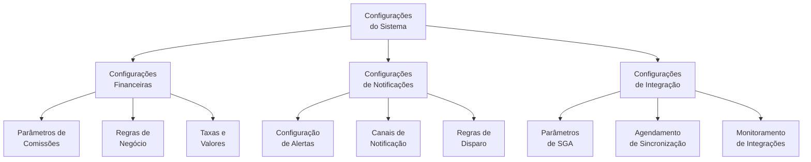

## 8. Fluxos Principais de Usuários

### 8.1 Fluxo de Cadastro de Associado e Veículo

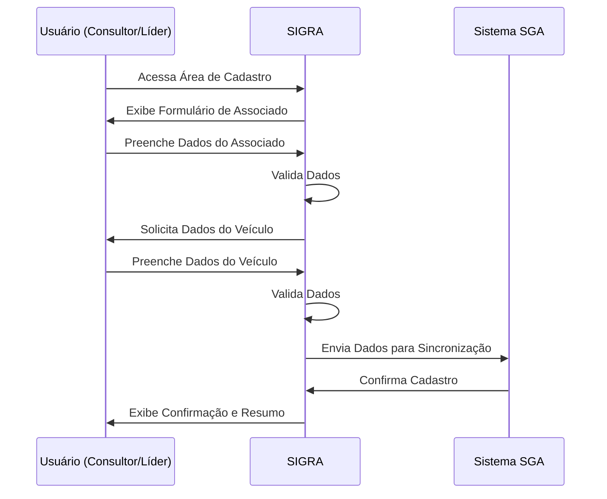

### 8.2 Fluxo de Registro de Pagamento e Cálculo de Comissões

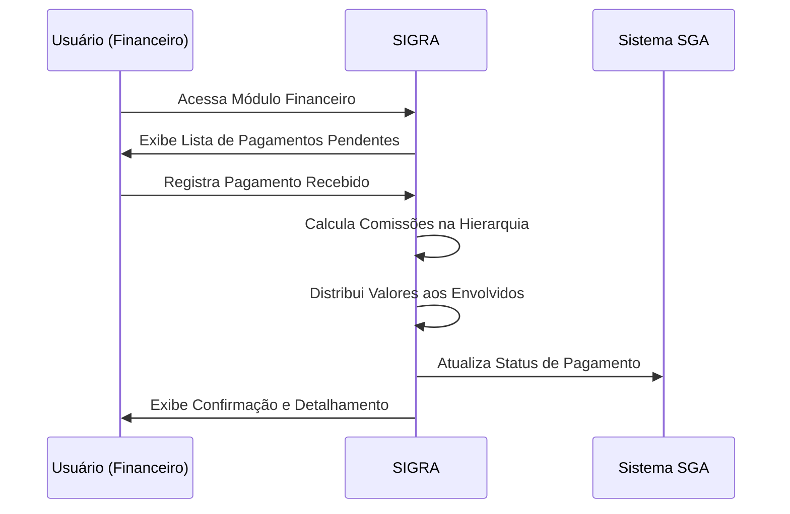

### 8.3 Fluxo de Solicitação e Aprovação de Adiantamento

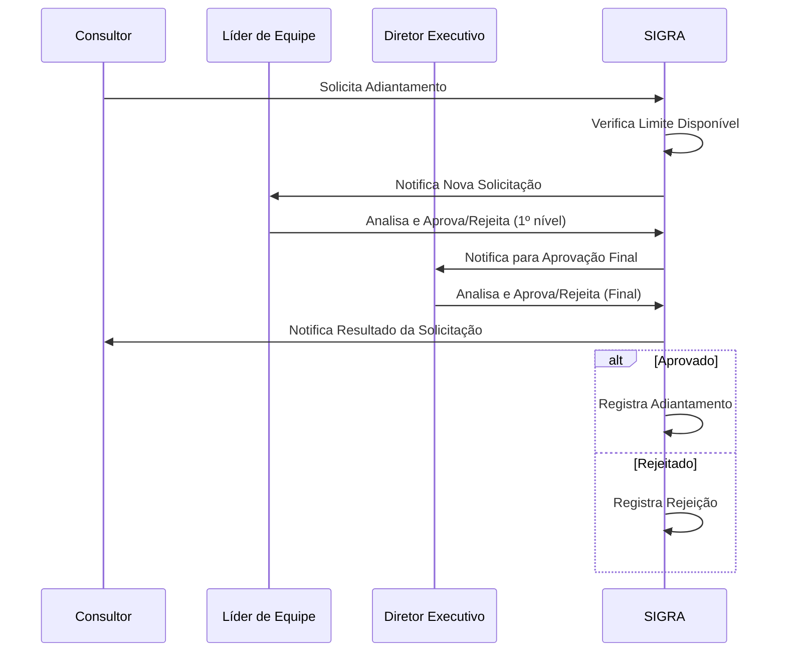

### 8.4 Fluxo de Sincronização com SGA

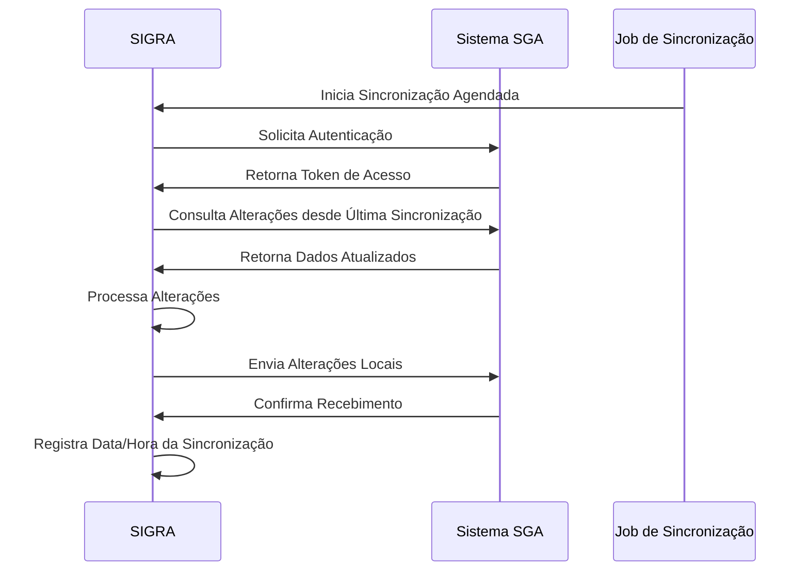

## 9. Cronograma de Implementação do MVP

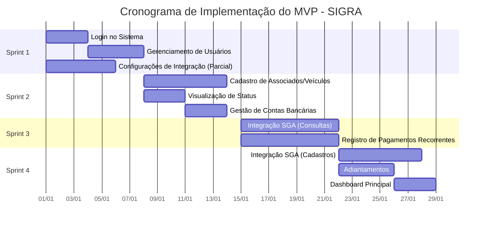

## 10. Arquitetura Técnica do MVP

```mermaid
graph TB
    subgraph "Frontend (React)"
        FE1[Componentes de UI]
        FE2[Estado (Context API)]
        FE3[Hooks Personalizados]
        FE4[Serviços de API]
    end
    
    subgraph "Backend (Node.js)"
        BE1[API REST]
        BE2[Controladores]
        BE3[Serviços]
        BE4[Repositórios]
        BE5[Jobs Agendados]
    end
    
    subgraph "Banco de Dados (MySQL)"
        DB1[Tabelas do Domínio]
        DB2[Índices]
        DB3[Procedures]
    end
    
    subgraph "Integrações"
        I1[API do SGA]
    end
    
    FE1 --> FE2
    FE2 --> FE3
    FE3 --> FE4
    FE4 --> BE1
    BE1 --> BE2
    BE2 --> BE3
    BE3 --> BE4
    BE3 --> BE5
    BE4 --> DB1
    BE4 --> DB2
    BE4 --> DB3
    BE5 --> I1
```

## 11. Modelo de Dados Simplificado para o MVP

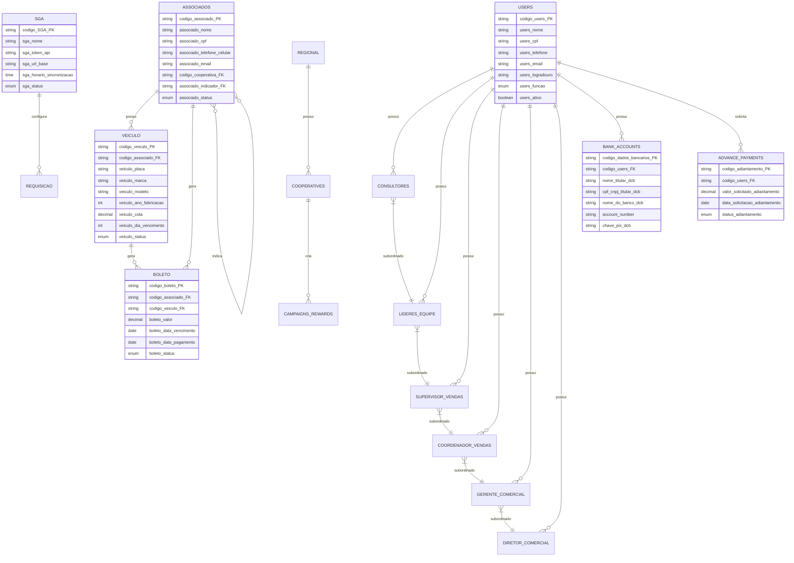